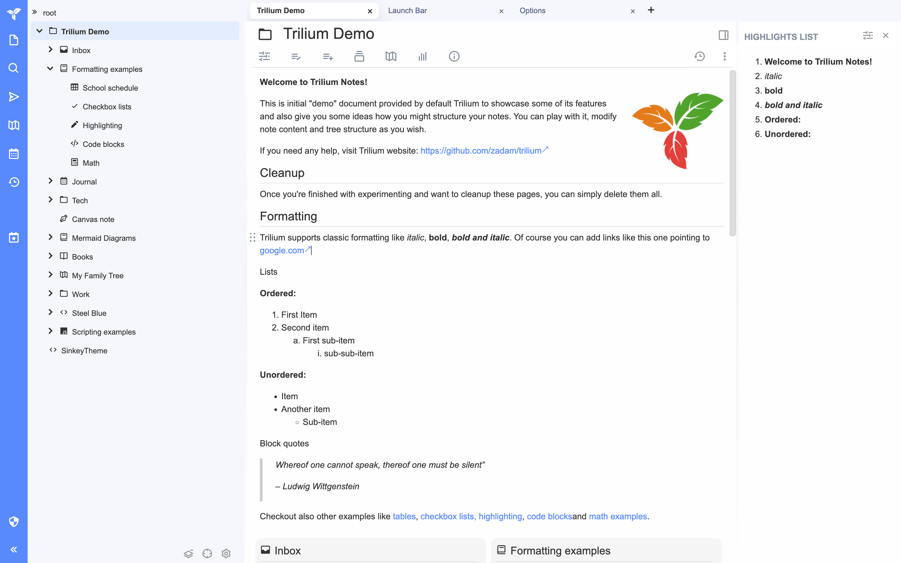

# Trilium-theme

#### English | [中文](README_CN.md)

A beautiful Trilium theme.

## Usage
1. Go to Releases to download the latest version of the theme note file.  
2. In Trilium, select a save location in the directory structure, right-click and click "Import into note", and select the theme file in the pop-up window.  
3. Click on the Trilium logo, select "Options" -> "Appearance", and choose "SinkeyTheme" from the dropdown menu.

## Preview

