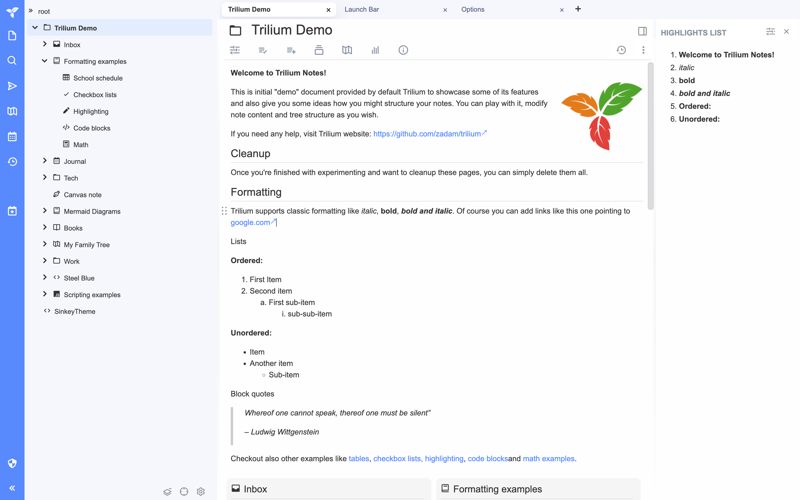
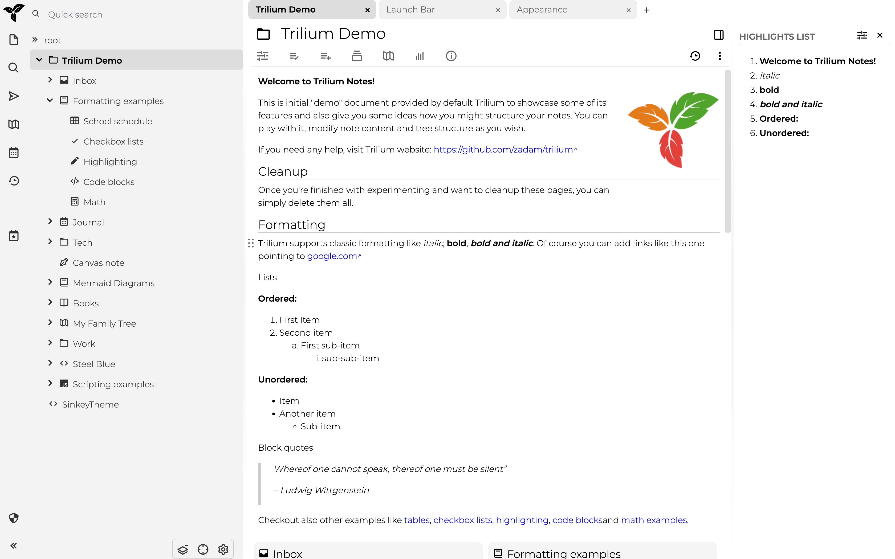

# Trilium-theme

#### 中文 | [English](README.md)

一个好看且优雅的Trilium的主题

## 使用方法
1.前往 Releases 下载最新版的主题笔记文件。  
2.在 Trilium 的笔记目录结构中，任选一个你喜欢的存放位置，右键选择 "导入到笔记"，并在弹出的导入窗口中选择下载的主题笔记文件。  
3.点击左上角的 logo，选择 "选项" -> "外观"，在主题栏的下拉菜单中选择 "SinkeyTheme"。

## 对比

